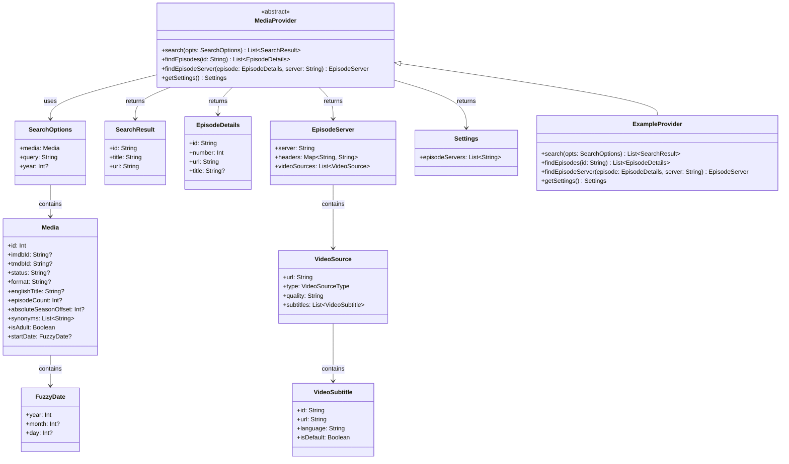

# Design Document: Extension Provider Refactor

## Overview

This design document outlines the refactoring of the PlayStream extension provider system to align with a standardized streaming provider interface pattern. The new architecture introduces cleaner type definitions adapted from the anime provider pattern for movie/show streaming, with improved search options containing rich media metadata and a flexible episode server discovery mechanism.

The refactoring will:
1. Define new data models (SearchResult, EpisodeDetails, EpisodeServer, VideoSource, VideoSubtitle, Media, SearchOptions, Settings)
2. Create an abstract MediaProvider class that extensions implement
3. Update the existing ExampleProvider to implement the new interface
4. Ensure JSON serialization/deserialization round-trips correctly

## Architecture



## Components and Interfaces

### MediaProvider (Abstract Class)

The base abstract class that all streaming providers must extend:

```kotlin
abstract class MediaProvider {
    abstract fun search(opts: SearchOptions): List<SearchResult>
    abstract fun findEpisodes(id: String): List<EpisodeDetails>
    abstract fun findEpisodeServer(episode: EpisodeDetails, server: String): EpisodeServer
    abstract fun getSettings(): Settings
}
```

### Type Definitions

All types will be implemented as Kotlin data classes with JSON serialization support via Gson.

## Data Models

### SearchResult
```kotlin
data class SearchResult(
    val id: String,      // Non-empty identifier
    val title: String,   // Non-empty title
    val url: String      // Non-empty URL
)
```

### EpisodeDetails
```kotlin
data class EpisodeDetails(
    val id: String,      // Non-empty identifier
    val number: Int,     // Positive integer (episode number)
    val url: String,     // Non-empty URL
    val title: String? = null  // Optional episode title
)
```

### EpisodeServer
```kotlin
data class EpisodeServer(
    val server: String,                    // Non-empty server name
    val headers: Map<String, String>,      // HTTP headers (can be empty)
    val videoSources: List<VideoSource>    // At least one VideoSource
)
```

### VideoSource
```kotlin
data class VideoSource(
    val url: String,                       // Non-empty streaming URL
    val type: VideoSourceType,             // "mp4" or "m3u8"
    val quality: String,                   // Non-empty quality string
    val subtitles: List<VideoSubtitle>     // Subtitle list (can be empty)
)

enum class VideoSourceType {
    MP4, M3U8
}
```

### VideoSubtitle
```kotlin
data class VideoSubtitle(
    val id: String,          // Non-empty identifier
    val url: String,         // Non-empty subtitle URL
    val language: String,    // Language code
    val isDefault: Boolean   // Whether this is the default subtitle
)
```

### Media
```kotlin
data class Media(
    val id: Int,                           // Non-negative identifier
    val imdbId: String? = null,            // Optional IMDB ID
    val tmdbId: String? = null,            // Optional TMDB ID
    val status: String? = null,            // Optional status
    val format: String? = null,            // Optional format
    val englishTitle: String? = null,      // Optional English title
    val episodeCount: Int? = null,         // Optional episode count
    val absoluteSeasonOffset: Int? = null, // Optional season offset
    val synonyms: List<String> = emptyList(), // Alternative titles
    val isAdult: Boolean,                  // Adult content flag
    val startDate: FuzzyDate? = null       // Optional start date
)
```

### FuzzyDate
```kotlin
data class FuzzyDate(
    val year: Int,
    val month: Int? = null,
    val day: Int? = null
)
```

### SearchOptions
```kotlin
data class SearchOptions(
    val media: Media,        // Media metadata
    val query: String,       // Non-empty search query
    val year: Int? = null    // Optional year filter
)
```

### Settings
```kotlin
data class Settings(
    val episodeServers: List<String>  // Available server names
)
```

## Error Handling

The extension provider will implement comprehensive error handling:

### Input Validation Errors
- Throw `IllegalArgumentException` for invalid SearchOptions (empty query, invalid Media)
- Throw `IllegalArgumentException` for invalid episode IDs
- Throw `IllegalArgumentException` for invalid server names

### Network Errors
- Throw `IOException` for network connectivity issues
- Throw `SocketTimeoutException` for request timeouts
- Include descriptive error messages with context

### Data Parsing Errors
- Throw `JsonParseException` for malformed JSON responses
- Throw `IllegalStateException` for unexpected response formats

### Error Response Format
All exceptions should include:
- Error type (validation, network, parsing)
- Descriptive message
- Original cause when applicable


