# PlayStream Flutter App - Class Diagram

```mermaid
classDiagram
    %% ============================================
    %% BACKEND SECTION
    %% ============================================
    namespace Backend {
        class ExtensionManager {
            -Box~ExtensionMetadata~ _extensionBox
            -Box~ExtensionInfo~ _availableExtensionsBox
            -Box~ExtensionPreferences~ _preferencesBox
            -Box~CacheEntry~ _cacheBox
            -Dio _dio
            -Logger _logger
            -List~String~ _enabledExtensions
            +create() ExtensionManager
            +fetchAvailableExtensions() List~ExtensionInfo~
            +downloadExtension(extensionId, downloadUrl) String
            +installExtension(extensionId, apkPath, name, version) bool
            +uninstallExtension(extensionId) bool
            +setExtensionEnabled(extensionId, enabled) void
            +checkForUpdates() Map~String,String~
            +searchAll(query) List~SearchResult~
            +findMovieServers(extensionId, movieId) List~StreamServer~
            +findEpisodeServers(extensionId, showId, season, episode) List~StreamServer~
        }

        class TraktClient {
            -DioClient _dioClient
            +TraktAuthApi auth
            +TraktMoviesApi movies
            +TraktShowsApi shows
            +TraktSyncApi sync
            +TraktUsersApi users
            +TraktSearchApi search
            +TraktGenresApi genres
            +TraktListsApi lists
            +TraktRecommendationsApi recommendations
            +setAuthToken(token) void
            +removeAuthToken() void
        }

        class DioClient {
            -Dio _dio
            -Logger _logger
            +dio Dio
            +setAuthToken(token) void
            +removeAuthToken() void
        }

        class ProfileService {
            +instance ProfileService
            +init() void
            +getCurrentProfile() UserProfile
        }

        class StreamScraper {
            -Dio _dio
            -ExtensionManager _extensionManager
            -Logger _logger
            +scrapeMovie(title, year, imdbId) List~StreamSource~
            +scrapeShow(title, season, episode, imdbId) List~StreamSource~
        }

        class Auth0Service {
            +login() void
            +logout() void
            +getUser() AppUser
        }
    }

    %% ============================================
    %% UI SECTION
    %% ============================================
    namespace UI {
        class HomeScreen {
            +build(context, ref) Widget
            -_buildMyAiringShowsSection() Widget
            -_buildRecommendedMediaSection() Widget
            -_buildTrendingMediaSection() Widget
            -_buildPopularMediaSection() Widget
            -_buildSectionHeader() Widget
        }

        class MovieDetailsScreen {
            +build(context, ref) Widget
            -_buildMovieInfo() Widget
            -_buildActionButtons() Widget
        }

        class ShowDetailsScreen {
            +build(context, ref) Widget
            -_buildShowInfo() Widget
            -_buildSeasonsList() Widget
        }

        class PlayerScreen {
            +build(context, ref) Widget
            -_buildVideoPlayer() Widget
            -_buildControls() Widget
        }

        class ExtensionScreen {
            +build(context, ref) Widget
            -_buildExtensionList() Widget
            -_buildInstallButton() Widget
        }

        class SearchScreen {
            +build(context, ref) Widget
            -_buildSearchBar() Widget
            -_buildResults() Widget
        }

        class ProfileScreen {
            +build(context, ref) Widget
            -_buildProfileInfo() Widget
            -_buildTraktSync() Widget
        }

        class WatchlistScreen {
            +build(context, ref) Widget
            -_buildWatchlistItems() Widget
        }

        class ShowCard {
            +media dynamic
            +isMovie bool
            +episode dynamic
            +build(context) Widget
        }

        class AppBottomNavBar {
            +currentRoute String
            +build(context) Widget
        }
    }

    %% ============================================
    %% CONTROLLERS SECTION
    %% ============================================
    namespace Controllers {
        class MovieController {
            +trendingMoviesProvider FutureProvider
            +popularMoviesProvider FutureProvider
            +anticipatedMoviesProvider FutureProvider
            +watchedMoviesProvider FutureProvider
            +movieDetailsProvider FutureProvider
            +relatedMoviesProvider FutureProvider
            +recommendedMoviesProvider FutureProvider
        }

        class ShowController {
            +trendingShowsProvider FutureProvider
            +popularShowsProvider FutureProvider
            +myAiringShowsProvider FutureProvider
            +myNewShowsProvider FutureProvider
            +showDetailsProvider FutureProvider
        }

        class AuthController {
            +authControllerProvider StateNotifierProvider
            +login() void
            +logout() void
            +checkAuthStatus() void
        }

        class WatchlistController {
            +watchlistProvider StateNotifierProvider
            +addToWatchlist(item) void
            +removeFromWatchlist(item) void
        }

        class TraktSyncController {
            +syncProvider StateNotifierProvider
            +syncWatchlist() void
            +syncHistory() void
        }

        class ProfileController {
            +profileProvider StateNotifierProvider
            +updateProfile(profile) void
            +switchProfile(profileId) void
        }
    }

    %% ============================================
    %% MODELS SECTION
    %% ============================================
    namespace Models {
        class TraktMovie {
            +String title
            +int year
            +TraktIds ids
            +String overview
            +String released
            +int runtime
            +double rating
            +TraktImages images
            +fromJson() TraktMovie
            +toJson() Map
        }

        class TraktShow {
            +String title
            +int year
            +TraktIds ids
            +String overview
            +int runtime
            +double rating
            +TraktImages images
            +fromJson() TraktShow
            +toJson() Map
        }

        class AppUser {
            +String id
            +String email
            +String name
            +bool isAdmin
            +UserRole role
            +fromJson() AppUser
            +toJson() Map
        }

        class UserProfile {
            +String id
            +String name
            +String avatar
            +bool isTraktConnected
            +String traktAccessToken
            +fromJson() UserProfile
            +toJson() Map
        }

        class ExtensionInfo {
            +String id
            +String name
            +String version
            +String description
            +String downloadUrl
            +fromJson() ExtensionInfo
            +toJson() Map
        }

        class ExtensionMetadata {
            +String id
            +String name
            +String version
            +String apkPath
            +bool isEnabled
            +DateTime installedAt
            +Map settings
            +copyWith() ExtensionMetadata
        }

        class SearchResult {
            +String id
            +String extensionId
            +String title
            +String type
            +String year
            +String posterUrl
        }

        class StreamServer {
            +String name
            +String url
            +String quality
            +String type
            +Map headers
        }

        class MovieDetails {
            +String id
            +String title
            +String overview
            +List~StreamServer~ servers
        }

        class EpisodeDetails {
            +String id
            +String title
            +int season
            +int episode
            +List~StreamServer~ servers
        }
    }

    %% ============================================
    %% APIS SECTION
    %% ============================================
    namespace APIs {
        class TraktAuthApi {
            -Dio _dio
            +getDeviceCode() Map
            +pollForToken(deviceCode) TraktAuth
            +refreshToken(refreshToken) TraktAuth
        }

        class TraktMoviesApi {
            -Dio _dio
            +getTrending(page, limit, extended) List~TraktTrendingMovie~
            +getPopular(page, limit, extended) List~TraktMovie~
            +getAnticipated(page, limit, extended) List~TraktAnticipatedMovie~
            +getSummary(slug, extended) TraktMovie
            +getRelated(movieId, page, limit, extended) List~TraktMovie~
        }

        class TraktShowsApi {
            -Dio _dio
            +getTrending(page, limit, extended) List~TraktShow~
            +getPopular(page, limit, extended) List~TraktShow~
            +getSummary(slug, extended) TraktShow
            +getMyAiringShows(days) List~Map~
            +getMyNewShows(days) List~Map~
        }

        class TraktSyncApi {
            -Dio _dio
            +getWatchlist(type) List
            +addToWatchlist(items) Map
            +removeFromWatchlist(items) Map
            +getHistory(type) List
        }

        class TraktUsersApi {
            -Dio _dio
            +getProfile(username) TraktUser
            +getSettings() Map
            +getStats(username) Map
        }

        class TraktSearchApi {
            -Dio _dio
            +search(query, type) List
            +searchById(idType, id) List
        }

        class TraktRecommendationsApi {
            -Dio _dio
            +getMovieRecommendations(ignoreWatchlisted, limit, extended) List~TraktMovie~
            +getShowRecommendations(ignoreWatchlisted, limit, extended) List
        }
    }

    %% ============================================
    %% EXTENSION INTERFACE
    %% ============================================
    namespace Extension {
        class ExtensionProvider {
            <<interface>>
            +extensionId String
            +name String
            +version String
            +search(query, imdbId, tmdbId, mediaType) List~SearchResult~
            +findMovie(movieId) MovieDetails
            +findEpisode(showId, season, episode) EpisodeDetails
            +findMovieServers(movieId) List~StreamServer~
            +findEpisodeServers(showId, season, episode) List~StreamServer~
            +getSettings() ExtensionSettings
        }

        class ExampleProvider {
            +extensionId String
            +name String
            +version String
            +search(query, imdbId, tmdbId, mediaType) List~SearchResult~
            +findMovie(movieId) MovieDetails
            +findEpisode(showId, season, episode) EpisodeDetails
            +findMovieServers(movieId) List~StreamServer~
            +findEpisodeServers(showId, season, episode) List~StreamServer~
            +getSettings() ExtensionSettings
        }
    }

    %% ============================================
    %% RELATIONSHIPS
    %% ============================================
    
    %% Backend relationships
    ExtensionManager --> ExtensionInfo : manages
    ExtensionManager --> ExtensionMetadata : stores
    ExtensionManager --> SearchResult : returns
    ExtensionManager --> StreamServer : provides
    TraktClient --> DioClient : uses
    TraktClient --> TraktAuthApi : contains
    TraktClient --> TraktMoviesApi : contains
    TraktClient --> TraktShowsApi : contains
    TraktClient --> TraktSyncApi : contains
    TraktClient --> TraktUsersApi : contains
    TraktClient --> TraktSearchApi : contains
    TraktClient --> TraktRecommendationsApi : contains
    StreamScraper --> ExtensionManager : uses
    StreamScraper --> StreamServer : returns

    %% UI to Controllers
    HomeScreen --> MovieController : watches
    HomeScreen --> ShowController : watches
    HomeScreen --> AuthController : watches
    MovieDetailsScreen --> MovieController : watches
    ShowDetailsScreen --> ShowController : watches
    WatchlistScreen --> WatchlistController : watches
    ProfileScreen --> ProfileController : watches
    ProfileScreen --> TraktSyncController : watches
    ExtensionScreen --> ExtensionManager : uses

    %% Controllers to Backend
    MovieController --> TraktClient : uses
    ShowController --> TraktClient : uses
    AuthController --> Auth0Service : uses
    WatchlistController --> TraktSyncApi : uses
    TraktSyncController --> TraktSyncApi : uses
    ProfileController --> ProfileService : uses

    %% APIs to Models
    TraktMoviesApi --> TraktMovie : returns
    TraktShowsApi --> TraktShow : returns
    TraktAuthApi --> AppUser : returns
    TraktUsersApi --> UserProfile : returns

    %% Extension relationships
    ExampleProvider ..|> ExtensionProvider : implements
    ExtensionManager --> ExtensionProvider : invokes
    ExtensionProvider --> SearchResult : returns
    ExtensionProvider --> MovieDetails : returns
    ExtensionProvider --> EpisodeDetails : returns
    ExtensionProvider --> StreamServer : returns

    %% Model relationships
    MovieDetails --> StreamServer : contains
    EpisodeDetails --> StreamServer : contains
    TraktMovie --> TraktIds : has
    TraktMovie --> TraktImages : has
    TraktShow --> TraktIds : has
    TraktShow --> TraktImages : has
    UserProfile --> AppUser : belongs to

    %% UI Components
    HomeScreen --> ShowCard : uses
    HomeScreen --> AppBottomNavBar : uses
    MovieDetailsScreen --> ShowCard : uses
    SearchScreen --> ShowCard : uses
```

## Architecture Overview

### Backend Layer
The backend layer handles all business logic, data management, and external integrations:
- **ExtensionManager**: Central service for managing extension lifecycle (download, install, uninstall, invoke)
- **TraktClient**: Main client for Trakt.tv API integration with specialized API services
- **DioClient**: HTTP client wrapper with authentication and logging
- **StreamScraper**: Coordinates streaming source discovery via extensions
- **ProfileService**: Manages user profiles and preferences
- **Auth0Service**: Handles authentication and authorization

### UI Layer
The UI layer contains all Flutter widgets and screens:
- **Screens**: HomeScreen, MovieDetailsScreen, ShowDetailsScreen, PlayerScreen, ExtensionScreen, SearchScreen, ProfileScreen, WatchlistScreen
- **Widgets**: Reusable components like ShowCard, AppBottomNavBar
- Uses Riverpod for state management and reactive updates

### Controllers Layer
Controllers bridge UI and backend using Riverpod providers:
- **MovieController**: Provides movie data streams (trending, popular, details, etc.)
- **ShowController**: Provides TV show data streams
- **AuthController**: Manages authentication state
- **WatchlistController**: Manages user watchlist
- **TraktSyncController**: Handles Trakt synchronization
- **ProfileController**: Manages user profile state

### APIs Layer
Specialized API services for Trakt.tv integration:
- **TraktAuthApi**: Authentication and token management
- **TraktMoviesApi**: Movie data and metadata
- **TraktShowsApi**: TV show data and metadata
- **TraktSyncApi**: Watchlist and history synchronization
- **TraktUsersApi**: User profile and settings
- **TraktSearchApi**: Content search functionality
- **TraktRecommendationsApi**: Personalized recommendations

### Extension System
Plugin architecture for extensible streaming sources:
- **ExtensionProvider**: Abstract interface defining extension contract
- **ExampleProvider**: Kotlin-based reference implementation
- Extensions run in isolated Android APK containers
- Communicate via method channels for security and stability
