# PlayStream Project Structure - Mermaid Class Diagram

```mermaid
classDiagram
    %% Main Application Entry
    class PlayStreamApp {
        +build(BuildContext) Widget
    }
    
    %% Core Configuration
    class AppConfig {
        +initialize() Future~void~
    }
    
    class AppRouter {
        +router GoRouter
    }
    
    class AppTheme {
        +darkTheme ThemeData
    }

    %% Controllers (State Management)
    class AuthController {
        +login() Future~void~
        +logout() Future~void~
    }
    
    class MovieController {
        +fetchMovies() Future~void~
        +searchMovies(String) Future~void~
    }
    
    class ShowController {
        +fetchShows() Future~void~
        +searchShows(String) Future~void~
    }
    
    class ProfileController {
        +updateProfile() Future~void~
    }
    
    class WatchlistController {
        +addToWatchlist() Future~void~
        +removeFromWatchlist() Future~void~
    }
    
    class TraktSyncController {
        +syncWithTrakt() Future~void~
    }

    %% User Models
    class AppUser {
        +String id
        +String email
        +String? name
        +String? picture
        +UserRole role
        +String? traktAccessToken
        +String? traktRefreshToken
        +DateTime? traktTokenExpiry
        +bool isAdmin
        +bool isTraktConnected
        +copyWith() AppUser
    }
    
    class UserRole {
        <<enumeration>>
        normal
        admin
    }
    
    class UserProfile {
        +String userId
        +Map settings
    }

    %% Extension Models
    class ExtensionMetadata {
        +String id
        +String name
        +String version
        +String apkPath
        +bool isEnabled
        +DateTime installedAt
        +Map~String,dynamic~ settings
        +copyWith() ExtensionMetadata
        +toJson() Map
        +fromJson(Map) ExtensionMetadata
    }
    
    class ExtensionInfo {
        +String id
        +String name
        +String version
        +String downloadUrl
        +toJson() Map
        +fromJson(Map) ExtensionInfo
    }
    
    class ExtensionProvider {
        <<interface>>
        +String extensionId
        +String name
        +String version
        +search(String) Future~List~SearchResult~~
        +findMovie(String) Future~MovieDetails~
        +findEpisode(String, int, int) Future~EpisodeDetails~
        +findMovieServers(String) Future~List~StreamServer~~
        +findEpisodeServers(String, int, int) Future~List~StreamServer~~
        +getSettings() Future~ExtensionSettings~
    }
    
    class ExtensionPreferences {
        +String extensionId
        +Map~String,dynamic~ preferences
    }
    
    class ExtensionSettings {
        +String extensionId
        +Map~String,dynamic~ settings
    }
    
    class SearchResult {
        +String id
        +String title
        +String type
        +String? year
        +String? posterUrl
        +String extensionId
    }
    
    class MovieDetails {
        +String id
        +String title
        +String? description
        +String? posterUrl
        +String? backdropUrl
        +int? year
        +List~StreamServer~ servers
    }
    
    class EpisodeDetails {
        +String showId
        +int season
        +int episode
        +String title
        +String? description
        +String? thumbnailUrl
        +List~StreamServer~ servers
    }
    
    class StreamServer {
        +String id
        +String name
        +String quality
        +String type
        +String url
        +Map~String,String~ headers
    }
    
    class CacheEntry {
        +String key
        +dynamic data
        +DateTime timestamp
        +Duration age
    }
    
    class ConsoleLogEntry {
        +String message
        +String level
        +DateTime timestamp
    }
    
    class SandboxExecutionResult {
        +String output
        +List~ConsoleLogEntry~ logs
        +bool success
    }
    
    class ExtensionException {
        +ExtensionErrorType type
        +String message
        +String? extensionId
        +dynamic originalError
    }

    %% Trakt Models
    class TraktMovie {
        +String? title
        +int? year
        +TraktIds? ids
        +String? overview
        +double? rating
        +List~String~? genres
        +TraktImages? images
        +toJson() Map
        +fromJson(Map) TraktMovie
    }
    
    class TraktShow {
        +String? title
        +int? year
        +TraktIds? ids
        +String? overview
        +double? rating
        +List~String~? genres
        +toJson() Map
        +fromJson(Map) TraktShow
    }
    
    class TraktIds {
        +int? trakt
        +String? slug
        +String? imdb
        +int? tmdb
    }
    
    class TraktImages {
        +List~String~? fanart
        +List~String~? poster
        +List~String~? logo
    }
    
    class TraktAuth {
        +String accessToken
        +String refreshToken
        +DateTime expiresAt
    }
    
    class TraktUser {
        +String username
        +String? name
        +TraktIds ids
    }
    
    class TraktSync {
        +List movies
        +List shows
        +DateTime lastSync
    }

    %% Services
    class ExtensionManager {
        -Box~ExtensionMetadata~ _extensionBox
        -Box~ExtensionInfo~ _availableExtensionsBox
        -Box~ExtensionPreferences~ _preferencesBox
        -Box~CacheEntry~ _cacheBox
        -Dio _dio
        -Logger _logger
        -List~String~ _enabledExtensions
        +create() Future~ExtensionManager~
        +fetchAvailableExtensions(bool) Future~List~ExtensionInfo~~
        +downloadExtension(String, String) Future~String~
        +installExtension(String, String, String, String) Future~bool~
        +uninstallExtension(String) Future~bool~
        +setExtensionEnabled(String, bool) Future~void~
        +getInstalledExtensions() List~ExtensionMetadata~
        +getEnabledExtensions() List~String~
        +checkForUpdates() Future~Map~String,String~~
        +updateExtension(String) Future~bool~
        +cancelDownload(String) bool
        +isDownloading(String) bool
    }
    
    class Auth0Service {
        +login() Future~void~
        +logout() Future~void~
        +getAccessToken() Future~String~
    }
    
    class ProfileService {
        +instance ProfileService
        +init() Future~void~
        +getProfile() UserProfile
        +updateProfile(UserProfile) Future~void~
    }
    
    class OnboardingService {
        +isOnboardingComplete() bool
        +completeOnboarding() Future~void~
    }
    
    class TraktClient {
        +Dio dio
        +get(String) Future~Response~
        +post(String, dynamic) Future~Response~
    }
    
    class TraktAuthApi {
        +authorize() Future~TraktAuth~
        +refreshToken(String) Future~TraktAuth~
    }
    
    class TraktMoviesApi {
        +getTrending() Future~List~TraktMovie~~
        +getPopular() Future~List~TraktMovie~~
        +getRecommended() Future~List~TraktMovie~~
    }
    
    class TraktShowsApi {
        +getTrending() Future~List~TraktShow~~
        +getPopular() Future~List~TraktShow~~
        +getRecommended() Future~List~TraktShow~~
    }
    
    class TraktSyncApi {
        +getWatchlist() Future~TraktSync~
        +addToWatchlist(String) Future~void~
        +removeFromWatchlist(String) Future~void~
    }
    
    class TraktUsersApi {
        +getProfile() Future~TraktUser~
        +getSettings() Future~Map~
    }
    
    class StreamScraper {
        +scrapeStreams(String) Future~List~StreamServer~~
    }
    
    class VideoPlaybackHelper {
        +playVideo(StreamServer) Future~void~
    }
    
    class VideoPlayerController {
        +play() void
        +pause() void
        +seek(Duration) void
    }
    
    class UrlLauncherService {
        +launchUrl(String) Future~void~
    }

    %% Views/Screens
    class ExtensionSandboxScreen {
        +String? _selectedExtensionId
        +String _selectedMethod
        +String _inputMode
        +TextEditingController _mediaTitleController
        +TextEditingController _kotlinCodeController
        +String _output
        +List~ConsoleLogEntry~ _consoleLogs
        +bool _isExecuting
        +build(BuildContext) Widget
    }

    %% Kotlin Extension (Android Side)
    class ExampleProvider {
        <<Kotlin>>
        +String extensionId
        +String name
        +String version
        +search(String) String
        +findMovie(String) String
        +findEpisode(String, int, int) String
        +findMovieServers(String) String
        +findEpisodeServers(String, int, int) String
        +getSettings() String
    }
    
    class IExtensionProvider {
        <<Kotlin Interface>>
        +String extensionId
        +String name
        +String version
        +search(String) String
        +findMovie(String) String
        +findEpisode(String, int, int) String
        +findMovieServers(String) String
        +findEpisodeServers(String, int, int) String
        +getSettings() String
    }

    %% Relationships - Main App
    PlayStreamApp --> AppRouter
    PlayStreamApp --> AppTheme
    PlayStreamApp --> ExtensionManager

    %% Relationships - Controllers
    AuthController --> Auth0Service
    AuthController --> AppUser
    MovieController --> TraktMoviesApi
    MovieController --> TraktMovie
    ShowController --> TraktShowsApi
    ShowController --> TraktShow
    ProfileController --> ProfileService
    ProfileController --> UserProfile
    WatchlistController --> TraktSyncApi
    TraktSyncController --> TraktSyncApi
    TraktSyncController --> TraktSync

    %% Relationships - User Models
    AppUser --> UserRole
    AppUser --> UserProfile

    %% Relationships - Extension Models
    ExtensionManager --> ExtensionMetadata
    ExtensionManager --> ExtensionInfo
    ExtensionManager --> ExtensionPreferences
    ExtensionManager --> CacheEntry
    ExtensionManager --> ExtensionException
    ExtensionProvider --> SearchResult
    ExtensionProvider --> MovieDetails
    ExtensionProvider --> EpisodeDetails
    ExtensionProvider --> StreamServer
    ExtensionProvider --> ExtensionSettings
    MovieDetails --> StreamServer
    EpisodeDetails --> StreamServer
    ExtensionSandboxScreen --> ExtensionManager
    ExtensionSandboxScreen --> ConsoleLogEntry
    ExtensionSandboxScreen --> SandboxExecutionResult

    %% Relationships - Trakt Models
    TraktMovie --> TraktIds
    TraktMovie --> TraktImages
    TraktShow --> TraktIds
    TraktShow --> TraktImages
    TraktUser --> TraktIds
    TraktAuth --> TraktUser

    %% Relationships - Services
    TraktAuthApi --> TraktClient
    TraktAuthApi --> TraktAuth
    TraktMoviesApi --> TraktClient
    TraktMoviesApi --> TraktMovie
    TraktShowsApi --> TraktClient
    TraktShowsApi --> TraktShow
    TraktSyncApi --> TraktClient
    TraktSyncApi --> TraktSync
    TraktUsersApi --> TraktClient
    TraktUsersApi --> TraktUser
    StreamScraper --> StreamServer
    VideoPlaybackHelper --> StreamServer
    VideoPlaybackHelper --> VideoPlayerController

    %% Relationships - Kotlin Extension
    ExampleProvider ..|> IExtensionProvider
    ExtensionManager ..> IExtensionProvider : "loads via MethodChannel"

    %% Storage
    class HiveStorage {
        <<Storage>>
        +Box~AppUser~
        +Box~UserProfile~
        +Box~ExtensionMetadata~
        +Box~ExtensionInfo~
        +Box~ExtensionPreferences~
        +Box~CacheEntry~
    }
    
    HiveStorage --> AppUser
    HiveStorage --> UserProfile
    HiveStorage --> ExtensionMetadata
    HiveStorage --> ExtensionInfo
    HiveStorage --> ExtensionPreferences
    HiveStorage --> CacheEntry
```

## Architecture Overview

### Flutter App (Dart)
- **Main Entry**: `PlayStreamApp` with Riverpod state management
- **Core**: Configuration, routing, and theming
- **Controllers**: State management for auth, movies, shows, profiles, watchlist
- **Models**: Data structures for users, extensions, Trakt integration
- **Services**: Business logic for extensions, auth, Trakt API, video playback
- **Views**: UI screens and widgets

### Extension System (Kotlin/Android)
- **Interface**: `IExtensionProvider` defines the contract
- **Implementation**: `ExampleProvider` demonstrates the extension pattern
- **Communication**: Flutter ↔ Kotlin via MethodChannel
- **Features**: Search, movie/show details, streaming servers

### Data Flow
1. User interacts with Flutter UI
2. Controllers manage state and call services
3. Services communicate with:
   - Trakt API for content metadata
   - Extension Manager for streaming sources
   - Local Hive storage for persistence
4. Extension Manager loads Kotlin extensions via MethodChannel
5. Extensions scrape and return streaming data

### Key Features
- **Extension Management**: Download, install, enable/disable extensions
- **Trakt Integration**: Sync watchlist, get recommendations
- **Video Playback**: Stream from multiple sources
- **Caching**: Reduce API calls with intelligent caching
- **Sandbox Testing**: Test extensions in isolated environment
